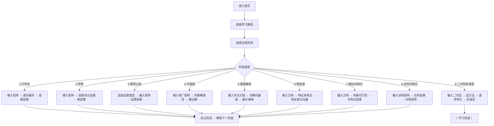

## 1. 产品概述

一个交互式线性代数学习平台，按"行列式→求秩→认识矩阵→刻画方程组→求基础解系→求特征方程与特征向量→相似对角阵→合同对角化→化二次型为标准型"的递进路径，引导学习者从基础概念逐步深入至核心技能。每个阶段提供交互式计算器、可视化演示和即时反馈，最终以"化二次型为标准型"为终极学习目标。

- **目标用户**：大学理工科学生、考研备考者、线性代数自学者
- **产品价值**：将抽象的线性代数概念转化为可视化的交互体验，降低学习门槛，建立直观理解

## 2. 核心功能

### 2.1 用户角色

本项目为纯前端学习工具，无需用户注册登录。

### 2.2 功能模块

1. **学习路径导航页**：展示9步学习路径的进度概览，当前所处阶段高亮
2. **行列式计算器**：支持2~4阶行列式的手动输入与逐步展开计算
3. **求秩工具**：输入矩阵，展示行阶梯化过程与秩的结果
4. **矩阵认知**：矩阵基本运算（加减乘、转置、逆）的可视化交互
5. **方程组刻画**：线性方程组的矩阵表示、解的判定（唯一解/无穷解/无解）
6. **基础解系**：齐次方程组的基础解系求解与展示
7. **特征方程与特征向量**：特征多项式推导、特征值与特征向量计算
8. **相似对角化**：判断矩阵是否可对角化、展示对角化过程
9. **合同对角化**：二次型矩阵的合同变换过程
10. **化二次型为标准型**：正交变换法与配方法两种方式，完整展示从二次型到标准型的转化过程（最终目标模块）

### 2.3 页面详情

| 页面名称 | 模块名称 | 功能描述 |
|---------|---------|---------|
| 首页/导航页 | 学习路径图 | 9个学习阶段的卡片式展示，点击进入对应模块，已完成阶段有勾选标记 |
| 首页/导航页 | 进度概览 | 显示当前学习进度百分比、完成模块数 |
| 行列式页面 | 矩阵输入区 | N×N 网格输入（2~4阶可调），支持整数和分数 |
| 行列式页面 | 计算演示区 | 按行/列展开的逐步过程，每步高亮操作的行/列，公式渲染 |
| 行列式页面 | 结果展示区 | 最终行列式值，支持复制 |
| 求秩页面 | 矩阵输入区 | 任意 m×n 矩阵输入（最大6×6） |
| 求秩页面 | 行变换过程 | 逐步高斯消元动画，每步标注倍乘、倍加操作 |
| 求秩页面 | 秩结果 | 阶梯形矩阵与秩数值 |
| 矩阵认知页面 | 双矩阵运算 | 两个矩阵的加减乘运算，拖拽调整维度 |
| 矩阵认知页面 | 单矩阵操作 | 转置、求逆（2~3阶为主）、行列式 |
| 方程组页面 | 增广矩阵输入 | 系数矩阵+常数项，支持任意方程数 |
| 方程组页面 | 解的判定 | 根据秩的关系自动判断解类型，配文字说明 |
| 方程组页面 | 解的输出 | 唯一解/通解的公式展示 |
| 基础解系页面 | 齐次方程组输入 | 系数矩阵输入 |
| 基础解系页面 | 解向量展示 | 基础解系的向量组，渲染为列向量 |
| 特征值页面 | 矩阵输入 | 方阵输入（2~4阶） |
| 特征值页面 | 特征多项式 | 特征多项式展开步骤 |
| 特征值页面 | 特征值与特征向量 | 列表展示每个特征值对应的特征向量 |
| 相似对角化页面 | 矩阵输入与判定 | 输入方阵，自动判断是否可对角化 |
| 相似对角化页面 | 对角化过程 | P 矩阵（特征向量组成）、对角矩阵 Λ 展示 |
| 合同对角化页面 | 对称矩阵输入 | 对称矩阵输入，展示合同变换过程 |
| 合同对角化页面 | 对角化结果 | 合同对角矩阵与变换矩阵 |
| 二次型标准型页面 | 二次型输入 | 以系数形式输入二次型 |
| 二次型标准型页面 | 正交变换法 | 完整步骤：特征值→特征向量→正交化→单位化→正交变换 |
| 二次型标准型页面 | 配方法 | 逐步配方过程，公式推导动画 |

## 3. 核心流程

## 4. 用户界面设计

### 4.1 设计风格

- **主色调**：深色黑板背景 (#1a1a2e 深夜蓝)，配合白色粉笔质感文字
- **强调色**：金色 (#e2b04a) 用于关键数学符号和高亮；薄荷绿 (#4ecdc4) 用于正确结果和进度标记
- **字体**：标题使用 "Crimson Text" 衬线字体（学术感）；正文和公式使用 "IBM Plex Sans" + KaTeX 数学渲染
- **按钮**：圆角卡片式，悬停有柔和光晕效果
- **布局**：左侧固定导航栏 + 右侧主内容区，类似教科书章节布局
- **图标**：数学符号风格的 SVG 图标，简洁几何化
- **氛围**：复古学术风与现代交互的结合——"数字黑板"概念，有粉笔灰尘颗粒的微妙背景纹理，数学公式如板书般逐步呈现

### 4.2 页面设计概览

| 页面名称 | 模块名称 | UI 元素 |
|---------|---------|--------|
| 首页 | 学习路径图 | 9张横向排列的步骤卡片，卡片间由金色连线连接，当前步骤放大+发光，已完成步骤绿色勾✓ |
| 首页 | 进度条 | 顶部进度条，金色填充，百分比数字 |
| 各计算页 | 矩阵输入区 | 网格输入框，类似表格但风格化为黑板上的粉笔格子，聚焦时边框变金色 |
| 各计算页 | 步骤演示区 | 公式动态渲染，步骤间有淡入动画，当前操作行高亮 |
| 各计算页 | 操作按钮 | 金色描边按钮，"计算"/"下一步"/"重置"等 |
| 各计算页 | 结果展示 | 大号公式渲染，成功时薄荷绿，错误时暖橙红提示 |

### 4.3 响应式设计

- 桌面端优先（1280px+），最大宽度限制 1400px 居中
- 平板端（768-1280px）：导航栏收起到顶部汉堡菜单
- 移动端（<768px）：单列布局，矩阵输入为紧凑网格
- 触控优化：输入框最小44px触摸区域

### 4.4 数学渲染方案

- 使用 KaTeX 进行数学公式渲染，轻量快速
- 矩阵使用 CSS Grid 自定义布局 + KaTeX 内联公式
- 步骤动画使用 CSS transitions + requestAnimationFrame
