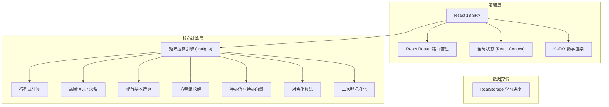
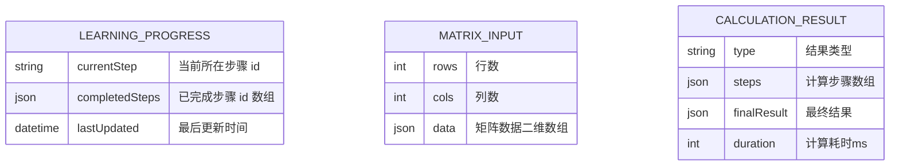

## 1. 架构设计



## 2. 技术选型

- **前端框架**：React 18 + TypeScript
- **构建工具**：Vite 5
- **样式方案**：TailwindCSS 3 + CSS 自定义变量
- **路由**：React Router v6
- **数学渲染**：KaTeX
- **状态管理**：React Context + useReducer
- **动画**：Framer Motion
- **后端**：无，纯前端项目
- **数据持久化**：localStorage（学习进度）

## 3. 路由定义

| 路由 | 页面名称 | 说明 |
|------|---------|------|
| `/` | 首页/学习路径导航 | 展示9步学习路径与进度 |
| `/determinant` | 行列式计算器 | 2~4阶行列式输入与计算 |
| `/rank` | 求秩 | 矩阵秩的计算与行阶梯化演示 |
| `/matrix` | 矩阵认知 | 矩阵基本运算交互 |
| `/equations` | 方程组刻画 | 线性方程组的矩阵表示与求解 |
| `/basic-solutions` | 基础解系 | 齐次方程组基础解系求解 |
| `/eigen` | 特征值与特征向量 | 特征多项式、特征值、特征向量 |
| `/similar-diagonal` | 相似对角化 | 矩阵相似对角化过程 |
| `/contract-diagonal` | 合同对角化 | 对称矩阵合同对角化 |
| `/quadratic-form` | 化二次型为标准型 | 正交变换法与配方法 |

## 4. 项目目录结构

```
Linear_Algebra/
├── index.html
├── package.json
├── vite.config.ts
├── tsconfig.json
├── tailwind.config.js
├── postcss.config.js
├── public/
│   └── favicon.svg
├── src/
│   ├── main.tsx
│   ├── App.tsx
│   ├── index.css
│   ├── components/
│   │   ├── layout/
│   │   │   ├── Sidebar.tsx          # 左侧导航栏
│   │   │   ├── ProgressBar.tsx      # 进度条
│   │   │   └── Layout.tsx           # 主布局
│   │   ├── ui/
│   │   │   ├── MatrixInput.tsx      # 矩阵输入组件
│   │   │   ├── StepDisplay.tsx      # 步骤展示组件
│   │   │   ├── MathRenderer.tsx     # KaTeX 数学渲染
│   │   │   └── StepCard.tsx         # 学习步骤卡片
│   │   └── calculators/
│   │       ├── DeterminantCalc.tsx
│   │       ├── RankCalc.tsx
│   │       ├── MatrixCalc.tsx
│   │       ├── EquationCalc.tsx
│   │       ├── BasicSolutionsCalc.tsx
│   │       ├── EigenCalc.tsx
│   │       ├── SimilarDiagonalCalc.tsx
│   │       ├── ContractDiagonalCalc.tsx
│   │       └── QuadraticFormCalc.tsx
│   ├── pages/
│   │   ├── HomePage.tsx
│   │   ├── DeterminantPage.tsx
│   │   ├── RankPage.tsx
│   │   ├── MatrixPage.tsx
│   │   ├── EquationsPage.tsx
│   │   ├── BasicSolutionsPage.tsx
│   │   ├── EigenPage.tsx
│   │   ├── SimilarDiagonalPage.tsx
│   │   ├── ContractDiagonalPage.tsx
│   │   └── QuadraticFormPage.tsx
│   ├── engine/
│   │   ├── matrix.ts               # 矩阵基础操作
│   │   ├── determinant.ts          # 行列式计算
│   │   ├── elimination.ts          # 高斯消元与求秩
│   │   ├── equations.ts            # 方程组求解
│   │   ├── eigen.ts                # 特征值与特征向量
│   │   ├── diagonal.ts             # 对角化算法
│   │   └── quadratic.ts            # 二次型标准化
│   ├── context/
│   │   └── ProgressContext.tsx      # 学习进度状态管理
│   ├── hooks/
│   │   └── useProgress.ts          # 进度管理 Hook
│   └── types/
│       └── index.ts                # 类型定义
```

## 5. 核心类型定义

```typescript
// 矩阵类型
type Fraction = { num: number; den: number };
type MatrixElement = number | Fraction;
type Matrix = MatrixElement[][];

// 学习步骤
type StepId = 
  | 'determinant'
  | 'rank' 
  | 'matrix'
  | 'equations'
  | 'basic-solutions'
  | 'eigen'
  | 'similar-diagonal'
  | 'contract-diagonal'
  | 'quadratic-form';

// 步骤信息
interface StepInfo {
  id: StepId;
  title: string;
  description: string;
  order: number;
}

// 学习进度
interface LearningProgress {
  completedSteps: Set<StepId>;
  currentStep: StepId | null;
}

// 高斯消元步骤
interface EliminationStep {
  matrix: Matrix;
  operation: string;
  description: string;
}

// 特征值结果
interface EigenResult {
  eigenvalues: number[];
  eigenvectors: Matrix[];
  characteristicPolynomial: string;
}

// 对角化结果
interface DiagonalizationResult {
  diagonalizable: boolean;
  P?: Matrix;
  D?: Matrix;
  steps: string[];
}
```

## 6. 矩阵运算引擎核心算法

### 6.1 行列式计算
- 递归展开法（Laplace 展开）
- 支持2~4阶，超过4阶使用高斯消元

### 6.2 求秩
- 高斯消元 → 行阶梯形 → 非零行计数
- 记录每一步操作用于演示

### 6.3 特征值与特征向量
- 2阶：直接解特征方程 det(A - λI) = 0
- 3阶及以上：使用数值方法（幂迭代法等近似算法），结果以数值形式展示

### 6.4 对角化
- 判断代数重数 = 几何重数
- 特征向量组成 P 矩阵
- P⁻¹AP = Λ 对角阵

### 6.5 二次型标准化
- 正交变换法：特征值 → 特征向量 → Gram-Schmidt正交化 → 单位化
- 配方法：逐步配方完成平方和

## 7. 数据模型



localStorage 存储结构：
```json
{
  "linear-algebra-progress": {
    "completedSteps": ["determinant", "rank", "matrix"],
    "currentStep": "equations",
    "lastUpdated": "2025-01-01T00:00:00Z"
  }
}
```

## 8. 非功能需求

- **性能**：矩阵计算在 Web Worker 或主线程微任务中执行，避免阻塞 UI；4阶以下矩阵计算 < 100ms
- **无障碍**：语义化 HTML，键盘可导航，ARIA 标签
- **兼容性**：支持 Chrome/Firefox/Safari/Edge 最新两个大版本
- **数学精度**：分数使用有理数表示（num/den），避免浮点误差；最终结果支持小数近似和分数精确两种展示
